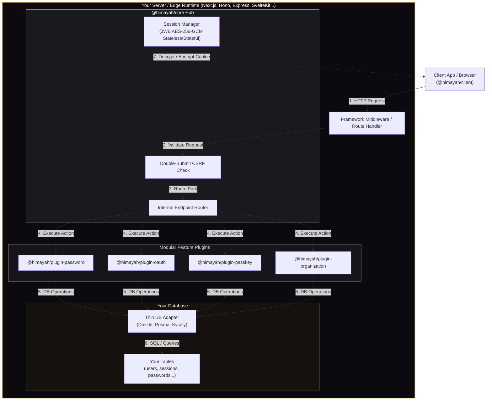

<p align="center">
  
</p>

<h1 align="center">Himayah (هيمية)</h1>

<p align="center">
  <strong>هيمية</strong> (himayah) — Arabic for <em>protection / shield</em>.
</p>

<p align="center">
  <em>A premium, lightweight, schema-first, type-safe, and Edge-compatible authentication framework for modern TypeScript applications.</em>
</p>

<p align="center">
  <a href="#high-level-architecture">View Architecture</a> •
  <a href="https://spellsaif.github.io/himayah">Documentation Site</a> •
  <a href="https://github.com/spellsaif/himayah">GitHub Repository</a> •
  <a href="#server-quickstart">Quickstart</a>
</p>

---

## Core Philosophy

Authentication is a foundational security concern, but modern developer choices have been split into two undesirable options: giving up full user data ownership to third-party hosted identity platforms, or incorporating giant, monolithic frameworks that take control of your schemas, database engines, and routing cycles.

**Himayah** rejects this compromise. Built around the concept of absolute protection, our architecture rests on four core philosophies:

* **Complete Schema & Data Ownership**: Himayah operates on thin database adapters. You define, migration-track, and manage your user tables, sessions, and roles. We do not touch your schemas or force hidden migrations.
* **Modular Composition Over Monoliths**: Authentication should be a tailored puzzle, not a rigid block. You only install what you need—whether it's passwords, multi-tenant organizations, OTP, passkeys, or OAuth—without carrying tree-shaking bulk or peer-dependency locks.
* **Hardened Security by Default**: Zero-config JSON Web Encryption (JWE) using AES-256-GCM symmetric ciphers, bitwise constant-time comparison algorithms to prevent side-channel timing attacks, and explicit no-throw `AuthResult` type unions instead of runtime exceptions.
* **Zero Lock-In Runtime Portability**: Truly platform-agnostic, running natively anywhere Web Crypto and Web standard Request/Response objects exist—including Cloudflare Workers, Vercel Edge, Bun, Deno, and standard Node.js.

---

## Key Principles

1. **Plain Web standard Request/Response**: Core runs on standard `Request` inputs and returns standard `Response` or JSON objects. Fits Next.js, Hono, Remix, Astro, SvelteKit, Nuxt 3, Elysia, Deno, Bun, and standard Node.js.
2. **Encrypted JWE by default**: Employs AES-GCM direct `A256GCM` key derivation using native Web Crypto APIs to shield user payloads from client exposure or middleman tampering.
3. **Double-Submit CSRF**: Built-in, bitwise-safe CSRF validation for all state-changing endpoints.
4. **Segmented Adapters**: You write user operations, session lookups, and account links separately. If you don't use database sessions or OAuth, you omit those tables and methods.
5. **No-Throw Error Unions**: Methods return `{ ok: true, data } | { ok: false, error }` enabling type-narrowing error resolution.

---

## Monorepo Layout

### Core & Middleware
* **[@himayah/core](packages/core)**: Composition engine, router, and built-in CSRF validation.
* **[@himayah/session](packages/session)**: Encrypted sessions using JWE A256GCM.
* **[@himayah/adapter](packages/adapter)**: Base interfaces for database adapters.
* **[@himayah/client](packages/client)**: Type-safe proxy API client.
* **[@himayah/next](packages/next)**: High-level Next.js App Router SDK wrapper.
* **[@himayah/cli](packages/cli)**: Scaffolding CLI tool for generating initial template code.
* **[@himayah/middleware-hono](packages/middleware-hono)**: Route handling and session injector for Hono.
* **[@himayah/middleware-express](packages/middleware-express)**: Route handling and session injector for Express.

### Authentication Plugins
* **[@himayah/plugin-password](packages/plugin-password)**: PBKDF2 secure password signup/signin.
* **[@himayah/plugin-oauth](packages/plugin-oauth)**: State/PKCE protection with built-in configurations (Google, GitHub, Apple).
* **[@himayah/plugin-passkey](packages/plugin-passkey)**: Ceremonies using `@simplewebauthn/server`.
* **[@himayah/plugin-magic-link](packages/plugin-magic-link)**: Token-auth with database token storage and rate-limiting.
* **[@himayah/plugin-otp](packages/plugin-otp)**: OTP generation, validation, and rate-limiting.
* **[@himayah/plugin-organization](packages/plugin-organization)**: Multi-tenant teams, role management, invitation links, and session-scoped organization switching.

### Database Adapters
* **[@himayah/adapter-drizzle](packages/adapter-drizzle)**: Segmented drizzle schema mapper.
* **[@himayah/adapter-prisma](packages/adapter-prisma)**: Prisma client query adapter.
* **[@himayah/adapter-kysely](packages/adapter-kysely)**: Kysely query adapter.

---

## High-Level Architecture

Himayah is designed to be highly modular, lightweight, and framework-agnostic. Below is a simplified, high-level overview of how requests flow from the client, through framework-specific middleware, into Himayah's core cryptographic engine, and ultimately map to your database tables:



---

## Server Quickstart

Initialize your auth engine in a file like `auth.ts`:

```ts
import { createAuth } from "@himayah/core";
import { createJWTSessionStore } from "@himayah/session";
import { passwordPlugin } from "@himayah/plugin-password";
import { drizzleAdapter } from "@himayah/adapter-drizzle";
import { db, users, credentials } from "./db";

export const auth = createAuth({
  adapter: drizzleAdapter(db, { users }),
  sessionStore: createJWTSessionStore({
    secret: process.env.AUTH_SECRET!,
    maxAge: 3600
  }),
  plugins: [
    passwordPlugin({
      getPasswordHash: async (userId) => {
        const cred = await db.query.credentials.findFirst({ where: eq(credentials.userId, userId) });
        return cred?.hash || null;
      },
      setPasswordHash: async (userId, hash) => {
        await db.insert(credentials).values({ userId, hash });
      }
    })
  ]
});
```

### Exposing HTTP Endpoints

Map it to your framework route handler (e.g. standard catch-all route under `/api/auth/*`):

#### Hono
```ts
app.use("*", honoMiddleware(auth));
```

#### Express
```ts
app.use(express.json());
app.use(expressMiddleware(auth));
```

---

## Type-Safe Client SDK

```ts
import { createClient } from "@himayah/client";
import type { auth } from "./auth"; // Type imported from server configuration

const client = createClient<typeof auth>({
  baseUrl: "/api/auth"
});

// Autocomplete and typechecking works 1:1 matching server plugins
const result = await client.password.signIn({
  email: "user@example.com",
  password: "password123"
});

if (!result.ok) {
  console.error("Sign in failed:", result.error.message);
} else {
  console.log("Welcome!", result.data.user);
}
```
