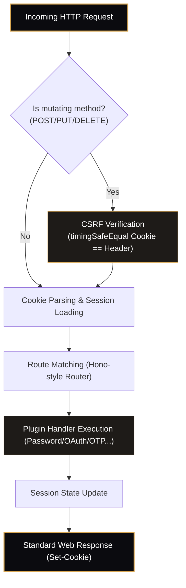
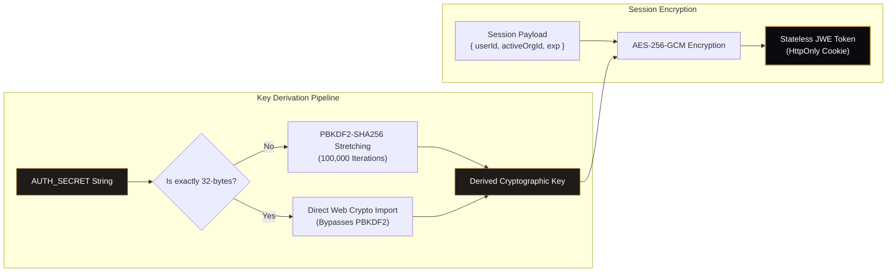
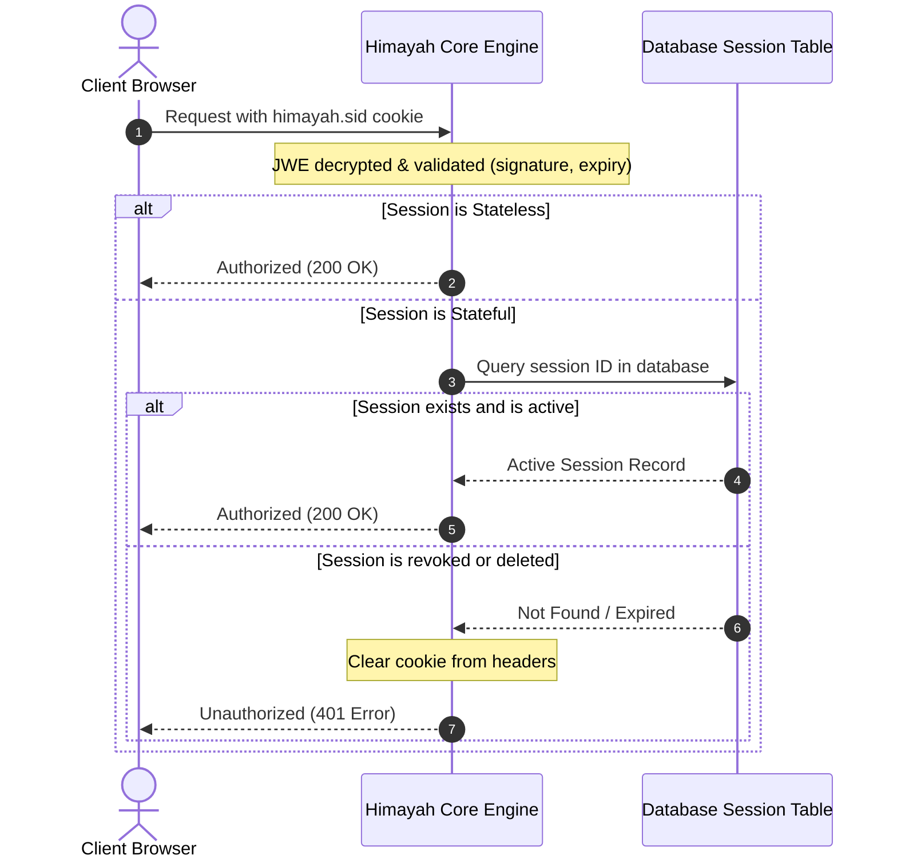
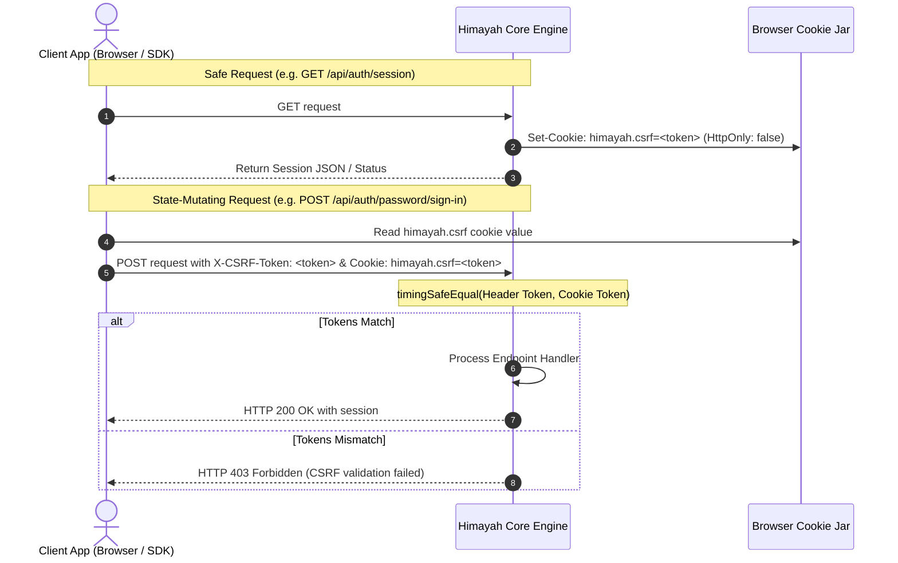

<p align="center">
  
</p>

<h1 align="center">Himayah (هيمية)</h1>

<p align="center">
  <strong>هيمية</strong> (himayah) — Arabic for <em>protection / shield</em>.
</p>

<p align="center">
  <em>A premium, lightweight, schema-first, type-safe, and Edge-compatible authentication framework for modern TypeScript applications.</em>
</p>

<p align="center">
  <a href="#visual-architecture--cryptographic-lifecycles">View Architecture</a> •
  <a href="https://github.com">Documentation Site</a> •
  <a href="#server-quickstart">Quickstart</a>
</p>

---

## The Branding & Identity

**Himayah** is styled around a high-end gold-and-obsidian palette. The minimalist front-facing silhouette of a girl with half-face covered represents **modesty, absolute privacy, and absolute security**—shielding your users' identities while giving you complete cryptographic ownership of your data structure and server engines.

Himayah is a modular, runtime-agnostic, zero-framework-dependency authentication engine for TypeScript. It relies on standard Web standard Request/Response schemas, executes cryptographically secure JWE-encrypted sessions by default, returns explicit `AuthResult` unions instead of throwing exceptions, and infers client SDK signatures from your server configuration.

---

## Key Principles

1. **Plain Web standard Request/Response**: Core runs on standard `Request` inputs and returns standard `Response` or JSON objects. Fits Next.js, Hono, Remix, Astro, SvelteKit, Nuxt 3, Elysia, Deno, Bun, and standard Node.js.
2. **Encrypted JWE by default**: Employs AES-GCM direct `A256GCM` key derivation using native Web Crypto APIs to shield user payloads from client exposure or middleman tampering.
3. **Double-Submit CSRF**: Built-in, bitwise-safe CSRF validation for all state-changing endpoints.
4. **Segmented Adapters**: You write user operations, session lookups, and account links separately. If you don't use database sessions or OAuth, you omit those tables and methods.
5. **No-Throw Error Unions**: Methods return `{ ok: true, data } | { ok: false, error }` enabling type-narrowing error resolution.

---

## Monorepo Layout

### Core & Middleware
* **[@himayah/core](packages/core)**: Composition engine, router, and built-in CSRF validation.
* **[@himayah/session](packages/session)**: Encrypted sessions using JWE A256GCM.
* **[@himayah/adapter](packages/adapter)**: Base interfaces for database adapters.
* **[@himayah/client](packages/client)**: Type-safe proxy API client.
* **[@himayah/next](packages/next)**: High-level Next.js App Router SDK wrapper.
* **[@himayah/cli](packages/cli)**: Scaffolding CLI tool for generating initial template code.
* **[@himayah/middleware-hono](packages/middleware-hono)**: Route handling and session injector for Hono.
* **[@himayah/middleware-express](packages/middleware-express)**: Route handling and session injector for Express.

### Authentication Plugins
* **[@himayah/plugin-password](packages/plugin-password)**: PBKDF2 secure password signup/signin.
* **[@himayah/plugin-oauth](packages/plugin-oauth)**: State/PKCE protection with built-in configurations (Google, GitHub, Apple).
* **[@himayah/plugin-passkey](packages/plugin-passkey)**: Ceremonies using `@simplewebauthn/server`.
* **[@himayah/plugin-magic-link](packages/plugin-magic-link)**: Token-auth with database token storage and rate-limiting.
* **[@himayah/plugin-otp](packages/plugin-otp)**: OTP generation, validation, and rate-limiting.
* **[@himayah/plugin-organization](packages/plugin-organization)**: Multi-tenant teams, role management, invitation links, and session-scoped organization switching.

### Database Adapters
* **[@himayah/adapter-drizzle](packages/adapter-drizzle)**: Segmented drizzle schema mapper.
* **[@himayah/adapter-prisma](packages/adapter-prisma)**: Prisma client query adapter.
* **[@himayah/adapter-kysely](packages/adapter-kysely)**: Kysely query adapter.

---

## Visual Architecture & Cryptographic Lifecycles

Himayah is built for total clarity. Here are the core structures that run your secure application under the hood:

### 1. Monorepo Topology & Relationships
This layout outlines how Himayah encapsulates concerns: Core sets up the engine context, adapters bridge the database tables, and framework middlewares capture the incoming requests:

```mermaid
graph TD
    subgraph Core ["Core Cryptographic Hub"]
        CoreLib["@himayah/core"]
        Session["@himayah/session"]
        Adapter["@himayah/adapter"]
        CoreLib --> Session
        CoreLib --> Adapter
    end

    subgraph Plugins ["Modular Feature Plugins"]
        Pw["@himayah/plugin-password"]
        Oauth["@himayah/plugin-oauth"]
        Magic["@himayah/plugin-magic-link"]
        Otp["@himayah/plugin-otp"]
        Passkey["@himayah/plugin-passkey"]
        Org["@himayah/plugin-organization"]
        
        Pw --> Adapter
        Oauth --> Adapter
        Magic --> Adapter
        Otp --> Adapter
        Passkey --> Adapter
        Org --> Adapter
    end

    subgraph Middlewares ["Runtime Framework Adapters"]
        Hono["@himayah/middleware-hono"]
        Express["@himayah/middleware-express"]
        Next["@himayah/next"]
        
        Hono --> CoreLib
        Express --> CoreLib
        Next --> CoreLib
    end

    subgraph DB ["Concrete Database Adapters"]
        Drizzle["@himayah/adapter-drizzle"]
        Prisma["@himayah/adapter-prisma"]
        Kysely["@himayah/adapter-kysely"]
        
        Drizzle --> Adapter
        Prisma --> Adapter
        Kysely --> Adapter
    end

    style CoreLib fill:#111,stroke:#d9a752,stroke-width:2px,color:#fff
    style Session fill:#1e1b18,stroke:#d9a752,stroke-width:1px,color:#fff
    style Adapter fill:#1e1b18,stroke:#d9a752,stroke-width:1px,color:#fff
    
    style Pw fill:#15151b,stroke:#a1a1aa,stroke-width:1px,color:#d1d1d6
    style Oauth fill:#15151b,stroke:#a1a1aa,stroke-width:1px,color:#d1d1d6
    style Magic fill:#15151b,stroke:#a1a1aa,stroke-width:1px,color:#d1d1d6
    style Otp fill:#15151b,stroke:#a1a1aa,stroke-width:1px,color:#d1d1d6
    style Passkey fill:#15151b,stroke:#a1a1aa,stroke-width:1px,color:#d1d1d6
    style Org fill:#15151b,stroke:#a1a1aa,stroke-width:1px,color:#d1d1d6
    
    style Hono fill:#0e1713,stroke:#10b981,stroke-width:1px,color:#a7f3d0
    style Express fill:#1c1917,stroke:#a8a29e,stroke-width:1px,color:#f5f5f4
    style Next fill:#0a0a0a,stroke:#e2e8f0,stroke-width:1px,color:#f8fafc
    
    style Drizzle fill:#181008,stroke:#f59e0b,stroke-width:1px,color:#fef3c7
    style Prisma fill:#0f172a,stroke:#3b82f6,stroke-width:1px,color:#dbeafe
    style Kysely fill:#061512,stroke:#0d9488,stroke-width:1px,color:#ccfbf1
```



### 2. Request Execution Pipeline
Incoming requests undergo double-submit CSRF checks (on POST/PUT/DELETE methods) before being routed to specific pluggable endpoint actions:



### 3. JWE Cryptographic Key Derivation Flow
If the provided `AUTH_SECRET` is not a raw 32-byte hex/base64 key, PBKDF2 stretching deriving occurs natively inside Web Crypto. Otherwise, direct Web Crypto imports take over to decrypt or encrypt the GCM ciphertext:



### 4. Stateful Session Revocation Check
When opted into database session tracking, validation flows compare standard JWE cookie tokens against immediate `sessions` records to intercept revoked keys:



### 5. Double-Submit CSRF Lifecycle
A secure random token is established in non-`HttpOnly` cookies, which is subsequently read by the client and included in custom payload headers, and verified in timing-safe comparisons on mutating endpoints:



---

## Server Quickstart

Initialize your auth engine in a file like `auth.ts`:

```ts
import { createAuth } from "@himayah/core";
import { createJWTSessionStore } from "@himayah/session";
import { passwordPlugin } from "@himayah/plugin-password";
import { drizzleAdapter } from "@himayah/adapter-drizzle";
import { db, users, credentials } from "./db";

export const auth = createAuth({
  adapter: drizzleAdapter(db, { users }),
  sessionStore: createJWTSessionStore({
    secret: process.env.AUTH_SECRET!,
    maxAge: 3600
  }),
  plugins: [
    passwordPlugin({
      getPasswordHash: async (userId) => {
        const cred = await db.query.credentials.findFirst({ where: eq(credentials.userId, userId) });
        return cred?.hash || null;
      },
      setPasswordHash: async (userId, hash) => {
        await db.insert(credentials).values({ userId, hash });
      }
    })
  ]
});
```

### Exposing HTTP Endpoints

Map it to your framework route handler (e.g. standard catch-all route under `/api/auth/*`):

#### Hono
```ts
app.use("*", honoMiddleware(auth));
```

#### Express
```ts
app.use(express.json());
app.use(expressMiddleware(auth));
```

---

## Type-Safe Client SDK

```ts
import { createClient } from "@himayah/client";
import type { auth } from "./auth"; // Type imported from server configuration

const client = createClient<typeof auth>({
  baseUrl: "/api/auth"
});

// Autocomplete and typechecking works 1:1 matching server plugins
const result = await client.password.signIn({
  email: "user@example.com",
  password: "password123"
});

if (!result.ok) {
  console.error("Sign in failed:", result.error.message);
} else {
  console.log("Welcome!", result.data.user);
}
```
