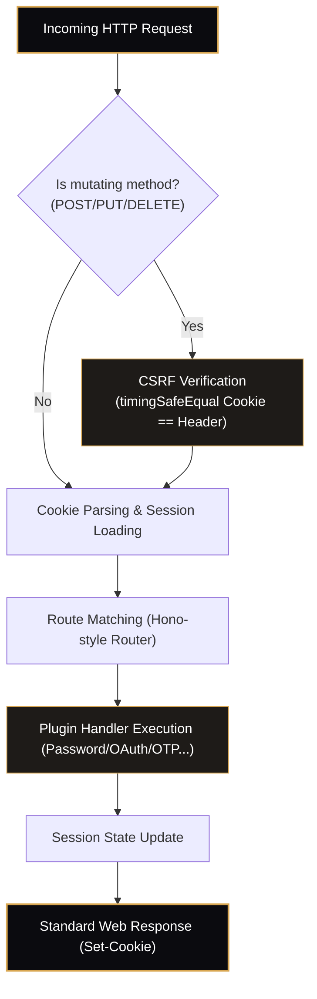
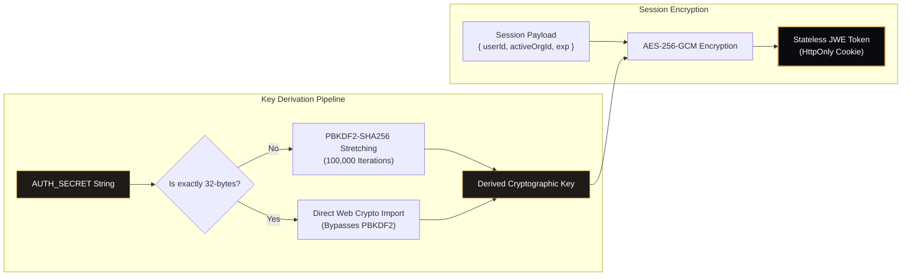
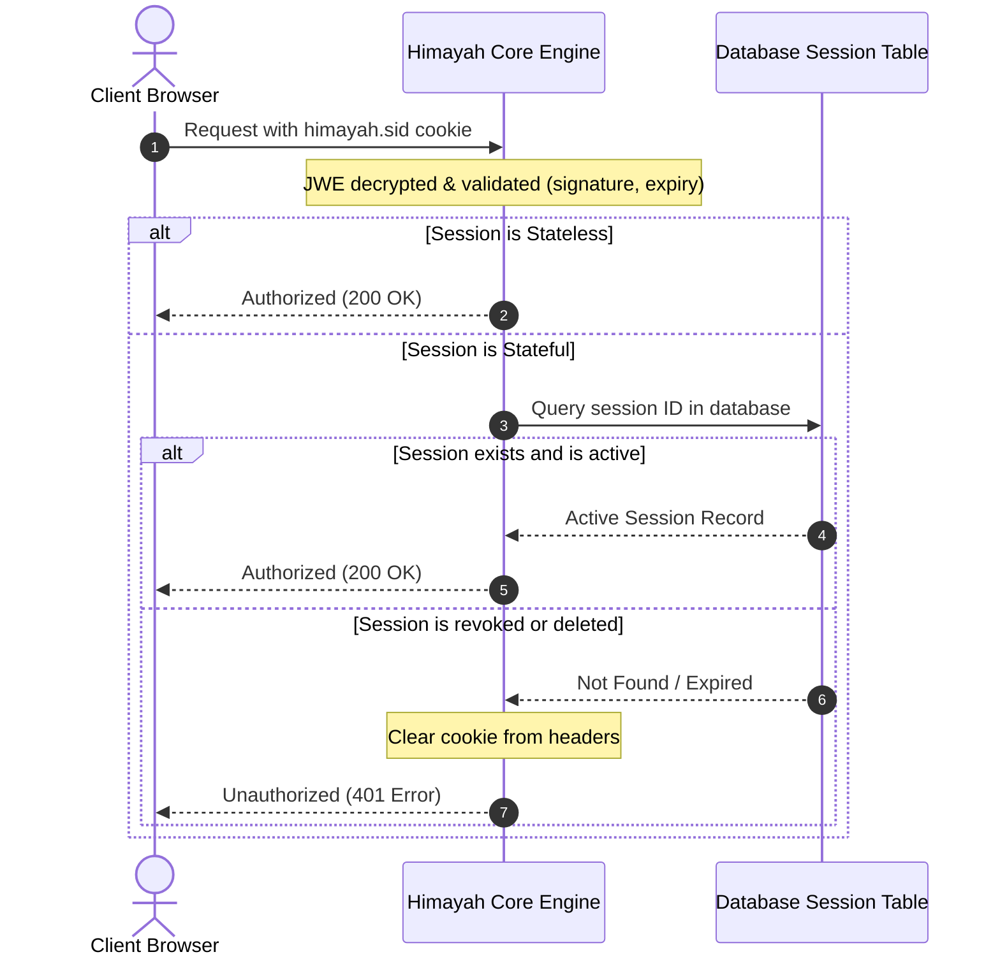
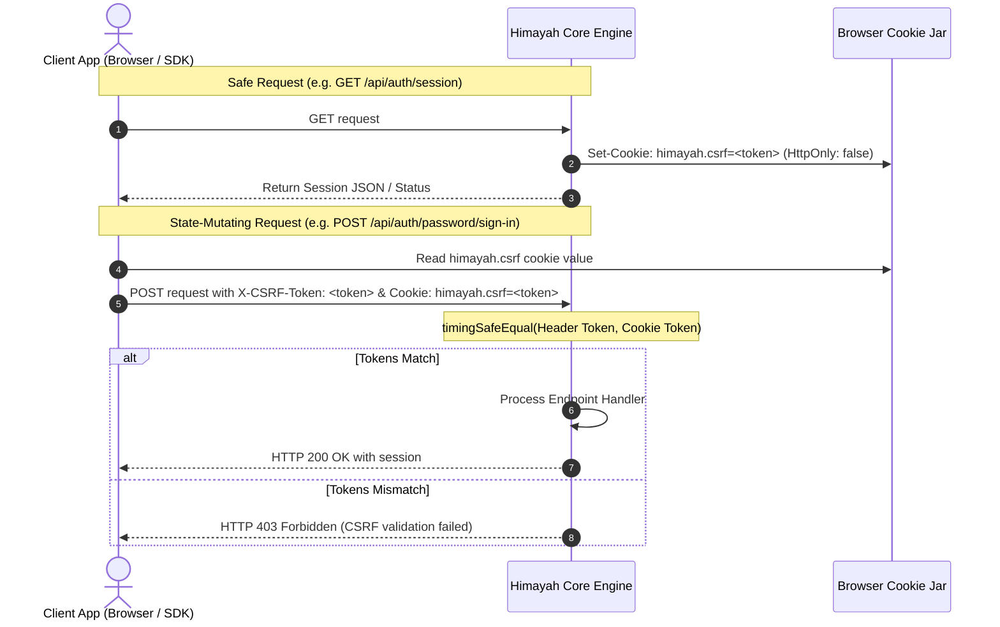
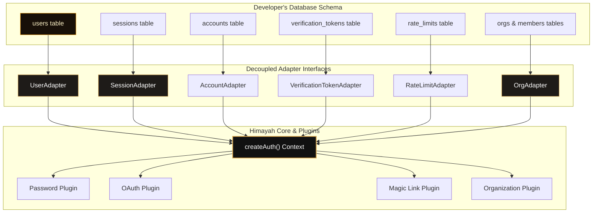

import { Callout } from 'fumadocs-ui/components/callout';
import { Tab, Tabs } from 'fumadocs-ui/components/tabs';

<p align="center">
  
</p>

# Core Architecture

**Himayah** (حماية — Arabic for *protection*) is built around three core ideas: **portability** (runs anywhere Web Crypto is available), **composability** (plugins register their own endpoints), and **schema ownership** (you control your database structure entirely).

This guide details the complete internals of the Himayah authentication engine, complete with visual flowcharts and sequence diagrams.

---

## System Topology & Package Layout

Himayah is structured as a monorepo containing decoupled, single-purpose packages under the `@himayah/` namespace. This design allows developers to only install what they use, keeping runtime sizes minimal and preventing dependency creep.

```mermaid
graph TD
    subgraph Core ["Core Cryptographic Hub"]
        CoreLib["@himayah/core"]
        Session["@himayah/session"]
        Adapter["@himayah/adapter"]
        CoreLib --> Session
        CoreLib --> Adapter
    end

    subgraph Plugins ["Modular Feature Plugins"]
        Pw["@himayah/plugin-password"]
        Oauth["@himayah/plugin-oauth"]
        Magic["@himayah/plugin-magic-link"]
        Otp["@himayah/plugin-otp"]
        Passkey["@himayah/plugin-passkey"]
        Org["@himayah/plugin-organization"]
        
        Pw --> Adapter
        Oauth --> Adapter
        Magic --> Adapter
        Otp --> Adapter
        Passkey --> Adapter
        Org --> Adapter
    end

    subgraph Middlewares ["Runtime Framework Adapters"]
        Hono["@himayah/middleware-hono"]
        Express["@himayah/middleware-express"]
        Next["@himayah/next"]
        
        Hono --> CoreLib
        Express --> CoreLib
        Next --> CoreLib
    end

    subgraph DB ["Concrete Database Adapters"]
        Drizzle["@himayah/adapter-drizzle"]
        Prisma["@himayah/adapter-prisma"]
        Kysely["@himayah/adapter-kysely"]
        
        Drizzle --> Adapter
        Prisma --> Adapter
        Kysely --> Adapter
    end

    style CoreLib fill:#111,stroke:#d9a752,stroke-width:2px,color:#fff
    style Session fill:#1e1b18,stroke:#d9a752,stroke-width:1px,color:#fff
    style Adapter fill:#1e1b18,stroke:#d9a752,stroke-width:1px,color:#fff
    
    style Pw fill:#15151b,stroke:#a1a1aa,stroke-width:1px,color:#d1d1d6
    style Oauth fill:#15151b,stroke:#a1a1aa,stroke-width:1px,color:#d1d1d6
    style Magic fill:#15151b,stroke:#a1a1aa,stroke-width:1px,color:#d1d1d6
    style Otp fill:#15151b,stroke:#a1a1aa,stroke-width:1px,color:#d1d1d6
    style Passkey fill:#15151b,stroke:#a1a1aa,stroke-width:1px,color:#d1d1d6
    style Org fill:#15151b,stroke:#a1a1aa,stroke-width:1px,color:#d1d1d6
    
    style Hono fill:#0e1713,stroke:#10b981,stroke-width:1px,color:#a7f3d0
    style Express fill:#1c1917,stroke:#a8a29e,stroke-width:1px,color:#f5f5f4
    style Next fill:#0a0a0a,stroke:#e2e8f0,stroke-width:1px,color:#f8fafc
    
    style Drizzle fill:#181008,stroke:#f59e0b,stroke-width:1px,color:#fef3c7
    style Prisma fill:#0f172a,stroke:#3b82f6,stroke-width:1px,color:#dbeafe
    style Kysely fill:#061512,stroke:#0d9488,stroke-width:1px,color:#ccfbf1
```



---

## Request Execution Pipeline

Every incoming HTTP request flows through a deterministic pipeline that validates incoming security tokens, resolves routes, executes plugins, and issues formatted cookies:



### The `handleRequest` Function

`auth.handleRequest(req: Request): Promise<Response>` is the single entry point for all auth routes. It:

1. Builds an internal context from the incoming `Request`
2. Verifies CSRF token for mutating methods (`POST`, `PUT`, `DELETE`, `PATCH`)
3. Routes to the matching plugin endpoint handler
4. Returns a standard `Response`

---

## Session Design

### Stateless JWE Sessions (default)

By default, Himayah uses **stateless sessions** via JSON Web Encryption (JWE). The session pipeline has two distinct steps:



**Why both?**
- **PBKDF2** is needed because `AUTH_SECRET` is typically a human-readable string — not a cryptographically uniform 32-byte key. PBKDF2 stretches it into one safely, with 100,000 iterations making brute-force impractical.
- **AES-256-GCM** is the actual symmetric cipher that encrypts the session payload. It's authenticated (provides integrity) and is the gold standard for symmetric encryption.

In other words: PBKDF2 *creates the key*, AES-256-GCM *uses the key to encrypt*. They're two layers of the same pipeline.

```ts
import { createJWTSessionStore } from "@himayah/session";

sessionStore: createJWTSessionStore({
  secret: process.env.AUTH_SECRET!, // string → PBKDF2 → 32-byte key → AES-256-GCM
  maxAge: 30 * 24 * 60 * 60,        // 30 days
})
```

<Callout type="info">
  **Shortcut for maximum performance:** if `AUTH_SECRET` is already a 32-byte hex or base64 key, Himayah detects this and **skips PBKDF2 entirely**, importing it directly via `crypto.subtle.importKey`. Use this on latency-sensitive Edge runtimes:
  ```bash
  # Generate a proper 32-byte key
  openssl rand -hex 32
  ```
  ```ts
  secret: Buffer.from(process.env.AUTH_SECRET_HEX!, "hex") // 32 bytes → skip PBKDF2
  ```
</Callout>

### Session Payload

The decrypted session contains the following shape:

```ts
interface HimayahSessionData {
  userId: string;
  sessionId?: string;   // present when using stateful sessions
  activeOrgId?: string; // present when using the organization plugin
  iat: number;          // issued at (unix timestamp)
  exp: number;          // expires at (unix timestamp)
}
```

### Stateful Database Sessions (for revocation)

When you need to immediately revoke sessions (e.g., account bans, forced sign-out on password change), switch to the database-backed session store:

```ts
import { createDatabaseSessionStore } from "@himayah/session";

sessionStore: createDatabaseSessionStore(adapter)
```

Here is a visual comparison between stateless JWE session validation and the stateful database revocation pipeline under the hood:



With this store:
- Each session is persisted to the `sessions` table with an expiry timestamp
- `auth.getSession(req)` validates the session **and** checks the database — invalidated sessions immediately return `{ ok: false }`
- `auth.signOut(req)` deletes the database row as well as the cookie

<Callout type="warning">
  Stateful sessions add one database query per authenticated request. Use JWE sessions when you don't need immediate revocation.
</Callout>

---

## Double-Submit CSRF Protection

All state-mutating requests (`POST`, `PUT`, `DELETE`, `PATCH`) are protected by **double-submit cookie CSRF validation**:

1. On the first page load, Himayah sets a non-`HttpOnly` cookie `himayah.csrf=<random-token>`
2. Your client must echo that token in the `x-csrf-token` request header
3. Himayah compares the cookie value and the header value using **constant-time comparison** (prevents timing oracle attacks)



```ts
// Client-side: read the cookie and echo it as a header
const csrfToken = document.cookie
  .split("; ")
  .find(row => row.startsWith("himayah.csrf="))
  ?.split("=")[1];

await fetch("/api/auth/password/sign-in", {
  method: "POST",
  headers: {
    "Content-Type": "application/json",
    "x-csrf-token": csrfToken!,
  },
  body: JSON.stringify({ email, password }),
});
```

<Callout type="info">
  The `@himayah/client` handles CSRF token extraction and injection automatically.
</Callout>

### Timing-Safe Comparison

All token comparisons in Himayah use a bitwise XOR-based `timingSafeEqual` that runs in constant time regardless of where the strings diverge:

```ts
// Internal implementation — always takes the same wall-clock time
function timingSafeEqual(a: string, b: string): boolean {
  const aBytes = new TextEncoder().encode(a);
  const bBytes = new TextEncoder().encode(b);
  if (aBytes.length !== bBytes.length) return false;
  let diff = 0;
  for (let i = 0; i < aBytes.length; i++) {
    diff |= aBytes[i] ^ bBytes[i];
  }
  return diff === 0;
}
```

This is applied to: CSRF token checks, OAuth state verification, and password hash comparisons.

---

## Adapter Segment Architecture

Himayah defines decoupled, segment-specific database contracts. Instead of a massive monolithic interface, adapters map individual tables directly to independent segments, providing modular flexibility and letting you omit tables you don't use.



---

## Plugin Composition

Plugins are plain TypeScript functions that return a `HimayahPlugin` descriptor:

```ts
interface HimayahPlugin {
  id: string;
  endpoints: Record<string, PluginEndpointHandler>;
  onStart?: (ctx: HimayahContext) => Promise<void>;
}
```

When `createAuth` is called with `plugins: [passwordPlugin(), oauthPlugin()]`, it:

1. Calls each plugin with the shared context (adapter, sessionStore, config)
2. Merges all endpoint registrations into a flat route map
3. Returns the configured `auth` object

Example of what `passwordPlugin` registers:

| HTTP Endpoint | Method | Description |
|---|---|---|
| `/api/auth/password/sign-up` | POST | Create a new user account |
| `/api/auth/password/sign-in` | POST | Authenticate and create session |
| `/api/auth/password/change-password` | POST | Update password (requires current session) |

---

## Platform Portability

Himayah uses **only** the Web Crypto API (`globalThis.crypto.subtle`), which is universally available:

<Tabs items={['Node.js 18+', 'Cloudflare Workers', 'Vercel Edge', 'Deno', 'Bun']}>
  <Tab value="Node.js 18+">
    ```ts
    // No extra config needed — Web Crypto is available globally in Node 18+
    import { createAuth } from "@himayah/core";
    ```
  </Tab>
  <Tab value="Cloudflare Workers">
    ```ts
    // Works natively — Workers expose globalThis.crypto
    export default {
      async fetch(request: Request, env: Env) {
        return auth.handleRequest(request);
      }
    };
    ```
  </Tab>
  <Tab value="Vercel Edge">
    ```ts
    // Set your route config to use the edge runtime
    export const runtime = "edge";

    export async function POST(req: Request) {
      return auth.handleRequest(req);
    }
    ```
  </Tab>
  <Tab value="Deno">
    ```ts
    // Deno has Web Crypto built in
    Deno.serve((req) => auth.handleRequest(req));
    ```
  </Tab>
  <Tab value="Bun">
    ```ts
    // Bun supports Web Crypto globally
    Bun.serve({
      fetch: (req) => auth.handleRequest(req),
    });
    ```
  </Tab>
</Tabs>

---

## Cookie Security Defaults

| Cookie | `HttpOnly` | `Secure` | `SameSite` | Purpose |
|---|---|---|---|---|
| `himayah.sid` | ✅ | ✅ | `Lax` | Encrypted session token |
| `himayah.csrf` | ❌ | ✅ | `Strict` | CSRF double-submit token (readable by JS) |

- **`HttpOnly`** on the session cookie prevents XSS-based session theft.
- **`Secure`** forces cookies over TLS in production.
- **`SameSite=Lax`** allows same-site navigations while blocking cross-site POSTs.
- The CSRF cookie is intentionally **not** `HttpOnly` so the browser client can read it.
