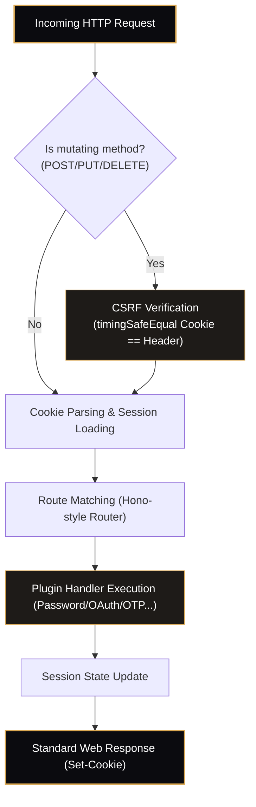
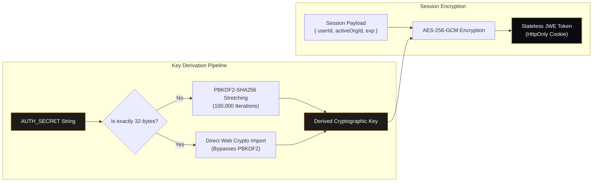
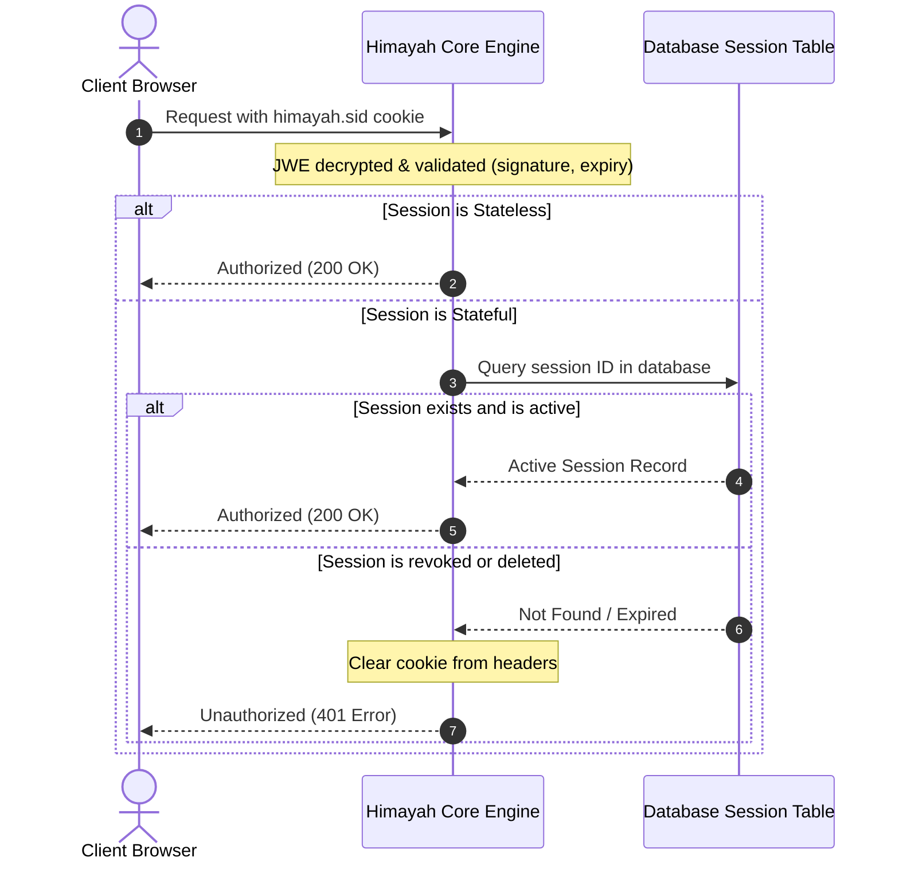
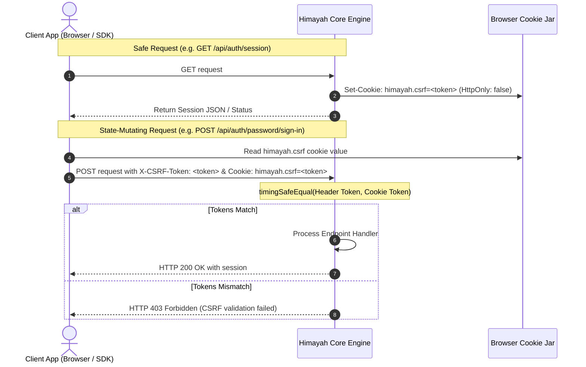
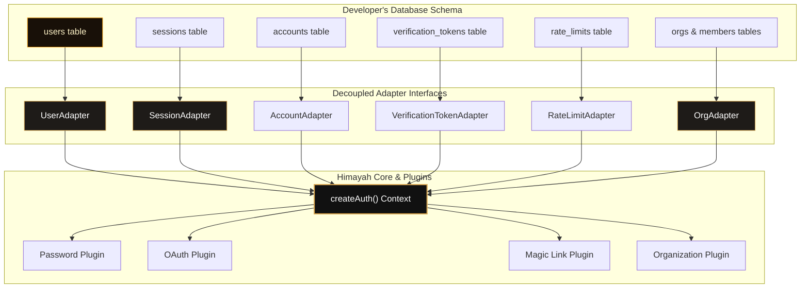

# Himayah Core Architecture & Security Design

> **هيمية** (himayah) — Arabic for *protection*

  

Himayah is a lightweight, type-safe, runtime-agnostic, and schema-first authentication library designed for TypeScript applications. It strictly adheres to modern security standards while offering a decoupled, developer-first composition API.

This document provides a deep, visual explanation of the architectural blocks and data flows inside Himayah.

---

## System Topology & Package Layout

Himayah is structured as a monorepo containing decoupled, single-purpose packages under the `@himayah/` namespace. This design allows developers to only install what they use, keeping runtime sizes minimal and preventing dependency creep.

```mermaid
graph TD
    subgraph Core ["Core Cryptographic Hub"]
        CoreLib["@himayah/core"]
        Session["@himayah/session"]
        Adapter["@himayah/adapter"]
        CoreLib --> Session
        CoreLib --> Adapter
    end

    subgraph Plugins ["Modular Feature Plugins"]
        Pw["@himayah/plugin-password"]
        Oauth["@himayah/plugin-oauth"]
        Magic["@himayah/plugin-magic-link"]
        Otp["@himayah/plugin-otp"]
        Passkey["@himayah/plugin-passkey"]
        Org["@himayah/plugin-organization"]
        
        Pw --> Adapter
        Oauth --> Adapter
        Magic --> Adapter
        Otp --> Adapter
        Passkey --> Adapter
        Org --> Adapter
    end

    subgraph Middlewares ["Runtime Framework Adapters"]
        Hono["@himayah/middleware-hono"]
        Express["@himayah/middleware-express"]
        Next["@himayah/next"]
        
        Hono --> CoreLib
        Express --> CoreLib
        Next --> CoreLib
    end

    subgraph DB ["Concrete Database Adapters"]
        Drizzle["@himayah/adapter-drizzle"]
        Prisma["@himayah/adapter-prisma"]
        Kysely["@himayah/adapter-kysely"]
        
        Drizzle --> Adapter
        Prisma --> Adapter
        Kysely --> Adapter
    end

    style CoreLib fill:#111,stroke:#d9a752,stroke-width:2px,color:#fff
    style Session fill:#1e1b18,stroke:#d9a752,stroke-width:1px,color:#fff
    style Adapter fill:#1e1b18,stroke:#d9a752,stroke-width:1px,color:#fff
    
    style Pw fill:#15151b,stroke:#a1a1aa,stroke-width:1px,color:#d1d1d6
    style Oauth fill:#15151b,stroke:#a1a1aa,stroke-width:1px,color:#d1d1d6
    style Magic fill:#15151b,stroke:#a1a1aa,stroke-width:1px,color:#d1d1d6
    style Otp fill:#15151b,stroke:#a1a1aa,stroke-width:1px,color:#d1d1d6
    style Passkey fill:#15151b,stroke:#a1a1aa,stroke-width:1px,color:#d1d1d6
    style Org fill:#15151b,stroke:#a1a1aa,stroke-width:1px,color:#d1d1d6
    
    style Hono fill:#0e1713,stroke:#10b981,stroke-width:1px,color:#a7f3d0
    style Express fill:#1c1917,stroke:#a8a29e,stroke-width:1px,color:#f5f5f4
    style Next fill:#0a0a0a,stroke:#e2e8f0,stroke-width:1px,color:#f8fafc
    
    style Drizzle fill:#181008,stroke:#f59e0b,stroke-width:1px,color:#fef3c7
    style Prisma fill:#0f172a,stroke:#3b82f6,stroke-width:1px,color:#dbeafe
    style Kysely fill:#061512,stroke:#0d9488,stroke-width:1px,color:#ccfbf1
```

---

## Request Execution Pipeline

Every incoming HTTP request flows through a deterministic pipeline:

### The `handleRequest` Function

`auth.handleRequest(req: Request): Promise<Response>` is the single entry point for all auth routes. It:

1. Builds an internal context from the incoming `Request`
2. Verifies CSRF token for mutating methods (`POST`, `PUT`, `DELETE`, `PATCH`)
3. Routes to the matching plugin endpoint handler
4. Returns a standard `Response`

---

## Session Design

### Stateless JWE Sessions (default)

By default, Himayah uses **stateless sessions** via JSON Web Encryption (JWE). The session pipeline has two distinct steps:

- **PBKDF2** stretches your human-readable `AUTH_SECRET` into a cryptographically uniform 32-byte key safely, with 100,000 iterations making brute-force attacks computationally impractical.
- **AES-256-GCM** is the symmetric cipher that encrypts the session payload. It is authenticated (guarantees payload integrity) and provides optimal encryption performance.

### Stateful Database Sessions (for revocation)

When session revocation is required (e.g., immediate forced sign-out or token banning), you can opt into a database-backed session store.

Below is the interaction sequence comparing stateless checks with stateful database lookups:

---

## Double-Submit CSRF Protection

Mutating endpoints are guarded by **double-submit cookie CSRF validation** comparing the request header token and custom cookie token:

---

## Adapter Segment Architecture

Himayah adapters are segmented to respect the "You own your schema" tenet. You map only the tables you need directly to thin segment interfaces.

