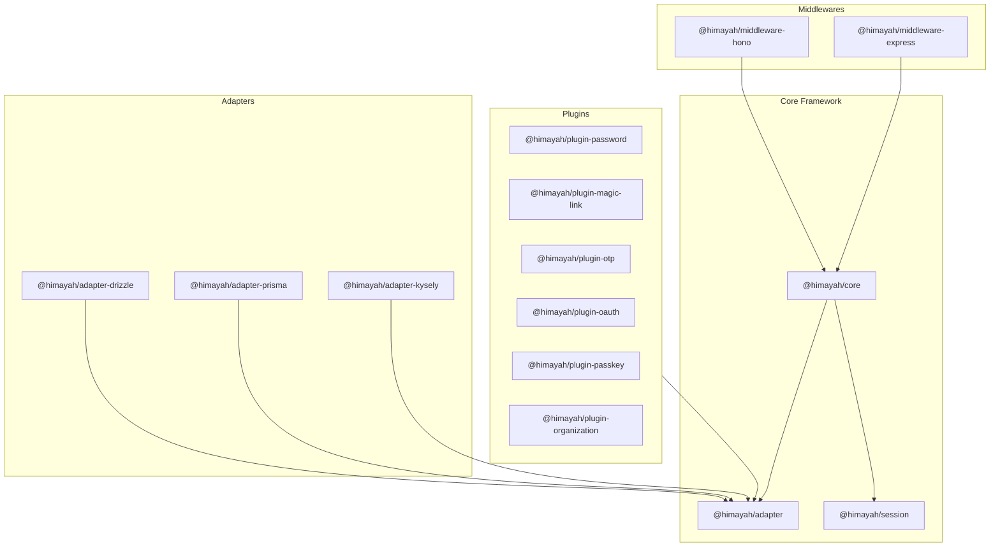

# Himayah Architecture & Security Design

> **هيمية** (himayah) — Arabic for "protection"

Himayah is a lightweight, type-safe, runtime-agnostic, and schema-first authentication library designed for TypeScript applications. It strictly adheres to modern security standards while offering a decoupled, developer-first composition API.

---

## Package Topology

Himayah is structured as a monorepo containing decoupled, single-purpose packages under the `@himayah/` namespace. This design allows developers to only install what they use, keeping runtime sizes minimal and preventing dependency creep.



---

## Security Principles

### 1. Plain Functions, Zero Middleware Lock-in
Rather than binding directly to a specific framework (like Next.js, Express, or Hono), Himayah core operates on standard Web Request/Response abstractions `(req) => Promise<Response>`. Framework-specific middlewares are optional wrappers that adapt the runtime context.

### 2. Encrypted Sessions by Default (JWE)
Unlike standard JSON Web Signatures (JWS) where the payload is public and readable by anyone, Himayah uses JSON Web Encryption (**JWE**) using **A256GCM** to store session data. 
- **Zero data leakage**: Sensitive claims (like `userId` or `activeOrgId`) are completely encrypted on the client side.
- **Tamper-proof**: Attempts to modify the session token are rejected during the GCM tag authentication phase.
- **Stateless/Stateful Hybrid**: Sessions can be validated completely statelessly (by decrypting the token with the shared server secret) or verified against a database token store if session revocation is required.

### 3. Double-Submit Cookie CSRF Protection
Himayah provides built-in, double-submit cookie CSRF validation for all state-changing endpoints (POST, PUT, DELETE):
- On safe GET requests (like `/api/auth/session`), Himayah issues a secure random CSRF token via a `himayah.csrf` cookie.
- For non-safe requests, the client must read the token from the cookie and send it in the request headers (e.g., `x-csrf-token`).
- The server validates that the header token matches the cookie token before processing the request, blocking cross-site request forgery attacks.

### 4. Zero Node-Specific Dependencies
Himayah depends strictly on the standard **Web Crypto API** (e.g. `crypto.subtle`) and standard Web Fetch APIs. This ensures complete compatibility with Edge runtimes (Cloudflare Workers, Vercel Edge, Deno, Bun) as well as Node.js.

### 5. Schema Ownership
Himayah does not ship with magic database migrations, hidden fields, or strict table naming requirements. You define the tables, and map them to our clean database adapters.

---

## Setup & Integration

### 1. Initialize Auth
```ts
import { createAuth } from "@himayah/core";
import { createJWTSessionStore } from "@himayah/session";
import { passwordPlugin } from "@himayah/plugin-password";
import { drizzleAdapter } from "@himayah/adapter-drizzle";

const auth = createAuth({
  adapter: drizzleAdapter(db, { users, sessions }),
  sessionStore: createJWTSessionStore({ secret: "YOUR_32_CHAR_SECRET", maxAge: 3600 }),
  plugins: [passwordPlugin({ getPasswordHash, setPasswordHash })],
  cookieName: "himayah.sid",
  csrf: true
});
```

### 2. Framework Routing
Mount the router using the Hono middleware:
```ts
import { Hono } from "hono";
import { honoMiddleware } from "@himayah/middleware-hono";

const app = new Hono();
app.use("*", honoMiddleware(auth));
```

Or using the Express middleware:
```ts
import express from "express";
import { expressMiddleware } from "@himayah/middleware-express";

const app = express();
app.use(express.json());
app.use(expressMiddleware(auth));
```
